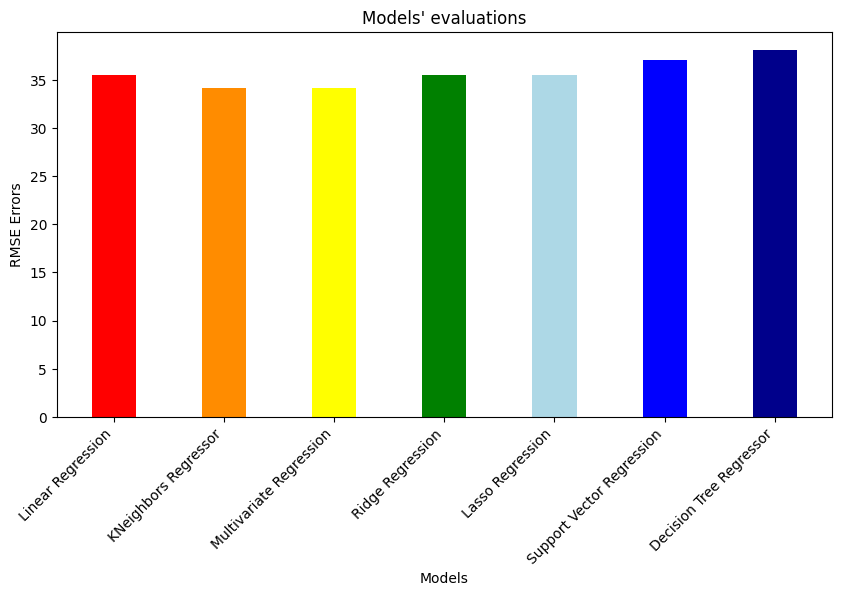

# AIN-311 Project: Predicting CO2 Emissions of Passenger Cars

As the climate change becoming a global problem over the years, reducing CO2 emission became a primal goal. Passenger cars are a significant contributor to CO2 emissions, making it essential to understand and predict real-world emissions accurately. This project aims to predict real-life CO2 emissions of passenger cars using given laboratory test information and real-world user-submitted or automatically recorded data.

We've used web-scraping to collect cars' real-world CO2 emissions and European Environment Agency (EEA)'s data about cars' mechanical features. We've collected data from 'spritmonitor.de' and 'honestjhon.uk' and merged them with EEA's data.

Then we've used 7 different regression models and evaluated them using root-mean-squared error (RMSE). Results are given in the plot below.

